# LexAI Architecture & Flow Diagram

This document contains the complete system architecture and user flow for the LexAI platform, mapping the journey from User Authentication through the Multi-Agent Document Processing Pipeline to the Frontend Staggered Dashboard.

```mermaid
flowchart TD
    %% Users
    U1((User))
    U2((User))
    U3((User))

    %% Authentication Flow
    Auth[AuthPage / Register & Login]
    AuthCheck{Session Valid?}
    
    U1 --> Auth
    U2 --> Auth
    U3 --> Auth
    Auth --> AuthCheck
    AuthCheck -- No --> Auth
    AuthCheck -- Yes --> Dashboard

    %% Database
    DB[(Supabase Database)]

    %% Frontend Dashboard Entry
    Dashboard[Hero Section]
    Upload[Dropzone PDF Uploader]
    Dashboard --> Upload

    %% API Pipeline
    Upload -- Extract & Hash --> DocService[Backend: Document Service API]
    DocService -- Check Cache --> CacheCheck{Exists in DB?}
    
    CacheCheck -- Yes --> DB
    CacheCheck -- No --> Orchestrator

    %% Multi-Agent Pipeline
    subgraph Multi-Agent AI Orchestrator
        direction TB
        InputProcessor[Input Processor Agent]
        Summary[Summarizer Agent]
        Timeline[Timeline Agent]
        Risk[Risk Agent]
        Strategy[Strategy Agent]
        Simulation[Simulation Agent]
        Critic[Critic Agent]
        
        InputProcessor -->|Clean Text| Summary
        InputProcessor -->|Clean Text| Timeline
        
        Summary -->|Summary Stats| Risk
        Summary -->|Summary Stats| Strategy
        Risk -->|Risk Factors| Strategy
        Strategy -->|Next Steps| Simulation
        Summary -->|Summary Stats| Simulation
        
        Simulation -->|Draft Output| Critic
    end

    Orchestrator --> InputProcessor
    Critic -- Final JSON Payload --> DB

    %% Frontend Dashboard Delivery
    DB -- Fetches Payload --> FrontendApp[Frontend App.jsx Orchestrator]

    %% Agentic Sequential UI Loading
    subgraph Agentic Sequential UI Rendering
        direction LR
        S_Summary[1. Legal Summary Panel]
        S_Timeline[2. Judicial Timeline & Risks]
        S_Strategy[3. Strategic Roadmap & Outcomes]
        S_Chat[4. Conversational LexAI]

        S_Summary -- 1200ms Delay --> S_Timeline
        S_Timeline -- 2600ms Delay --> S_Strategy
        S_Strategy -- 4000ms Delay --> S_Chat
    end

    FrontendApp --> S_Summary

    %% Conversational System
    S_Chat -- Sends User Message & Document ID --> ChatAPI[Backend: Chat API]
    ChatAPI -- Validates Context --> ServerMemory[(RAM: Parsed PDF Text)]
    ChatAPI -- Generates Response --> LLM[mixtral / llama-3 Groq Engine]
    LLM -- Streams Reply --> S_Chat

    classDef database fill:#1e293b,stroke:#94a3b8,color:#fff;
    classDef frontend fill:#0f172a,stroke:#38bdf8,color:#fff;
    classDef agent fill:#020617,stroke:#10b981,color:#fff;
    classDef external fill:#475569,stroke:#94a3b8,color:#fff;

    class DB,ServerMemory database;
    class Dashboard,Upload,FrontendApp,S_Summary,S_Timeline,S_Strategy,S_Chat frontend;
    class InputProcessor,Summary,Timeline,Risk,Strategy,Simulation,Critic,Orchestrator,LLM agent;
    class Auth,AuthCheck external;
```

